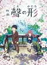
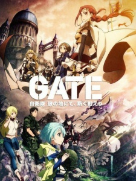
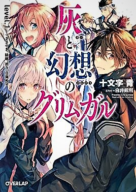
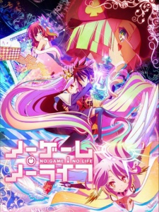

# 开发报告
[TOC]
## 本站点的策划思路
*站点组成：*本站点由五个简单的网页组成，其中一个首页，两个列表页，一个详细页，一个注册表单
 
- **实现目标** ：为喜爱动漫的小伙伴提供一个分享资源的平台，以及定期安利一些好看的动漫给小伙伴们
- **实现步骤** ：在首页推荐动漫，提供在线观看和网盘地址；设立动漫讨论区，欢迎小伙伴们在这里分享资源，讨论动漫。
- **期望的效果** ：有多多的小伙伴来这里分享资源和安利动漫。站主我定期推出推荐，希望很多人来观看，和来这里找其他地方没有的资源（笑）
- **内容来源** ：网站建设参考其他动漫网站外观，初期帖子内容来自百度；代码自己编写；

-------------------
## 页面结构与说明

> 网站首先有一个主页名为小宅动漫(https://jxrjean.github.io/stu16036814)  的网页。这个网页含有大量链接和图片，内容精彩，更有动漫推荐和帖子讨论区。是列表页火热内容的集合，吸引访客。2网站有列表页(https://jxrjean.github.io/stu16036814/liebiao1.html)   。这个列表页是主页帖子的扩展，含有大量链接，为访客提供更为详细周到的服务。3网站有列表页（https://jxrjean.github.io/stu16036814/liebiao2.html)的网站   。这个列表页是个帖子，可以由主页跳转而来也可由帖子列表页跳转而来，这个列表较为详细的推荐的五部动漫，是网站帖子的一个案例，为访客推荐动漫。含有跳转到详细页的链接，也有百度网盘的地址，给访客观看动漫提供便利。4网站有详细页(https://jxrjean.github.io/stu16036814/xiangxi.html)的网站  ,这个详细介绍了一部动漫no game no life。内含这个动漫的各种信息和在线观看的网址。5表单页(https://jxrjean.github.io/stu16036814/form.html)的网站 ，一个动漫网站的注册表单，出现乱码请改变游览器编码方式。— [小宅动漫](https://jxrjean.github.io/stu16036814)
## 技术指标
兼容游览器IE9+；html5 css2与css3；编辑工具Sublime
## 技术点说明
### 首页技术点
运用浮动和绝对定位难以解决首页布局
我运用了栅格布局，划分网页为十二列，其中动态图居右分四列，左边用区块并分八列。左边八列分为四个二，下面分为两个四来存放图片和链接。请看代码；
``` python
<div class="container_12" id="page">

 <section class="grid_8">
	  <h1>精彩尽在，欢迎来到xiaozhai动漫</h1>
		  <p>动画精彩推荐:</p>
		  <p class="grid_2">&nbsp;&nbsp;&nbsp;</p>
		  <p class="grid_2">&nbsp;&nbsp;&nbsp;</p>
		  <p class="grid_2"></p>
		  <p class="grid_2"></p>
		  <a class="grid_2" herf="">我的英雄学院2</a>
		  <a class="grid_2" herf="">Re:CREATORS</a>
		  <a class="grid_2" herf="">&nbsp;&nbsp;&nbsp;&nbsp;声之形</a>
		  <a class="grid_2" herf="">&nbsp;月色真美</a>
		  <p class="grid_2">爆燃，轰少年</p>
		  <p class="grid_2">前方高能</p>
		  <p class="grid_2">无声的世界,有你</p>
		  <p class="grid_2">这是(真)清恋</p>
		  <p class="grid_4"><span>[科幻]</span><a>ID0</a>剧情发展超乎意料</p>
		  <p class="grid_4"><span>[治愈]</span><a>夏目友人帐&nbsp;陆</a>一家三口带宠物</p>
		  <p class="grid_4"><span>[热血]</span><a>我的英雄学院第二季</a>热血回归</p>
		  <p class="grid_4"><span>[治愈]</span><a>爱丽丝与藏六</a>超能力loli与老爷爷</p>
		  <p class="grid_4"><span>[回归]</span><a>银魂</a>深夜档银他妈新系列</p>
		  <p class="grid_4"><span>[原创]</span><a>Re:CREATORS</a>当大触得妹纸</p>
		  <p class="grid_4"><span>[后宫]</span><a>怪怪守护神</a>能打的热血肉番</p>
		  <p class="grid_4"><span>[国产]</span><a>黑白无双</a>十年磨一剑，国漫最无双！</p>
		  <p class="grid_4"><span>[黑暗]</span><a>剑风传奇第三季</a>装备升级中</p>
		  <p class="grid_4"><span>[童年]</span><a>哆啦A梦新连载</a>当年的机器猫</p>
		  <p class="grid_4"><span>[科幻]</span><a>正确的KADO</a>不可思议的展开</p>
		  <p class="grid_4"><span>[奇幻]</span><a>巴哈姆特之怒第二季 </a>真·经费番</p>
		  <p class="grid_4"><span>[搞笑]</span><a>珈百璃的堕落</a>冥风淳朴</p>
		  <p class="grid_4"><span>[治愈]</span><a>樱花任务
		  </a>当个国王？</p>
		  <p class="grid_4"><span>[完结]</span><a>情热传说 THE X第二季</a>基友太美</p>
		  <p class="grid_4"><span>[科幻]</span><a>Frame Arms Girl</a>光明正大卖模型</p>
 </section>

	<div class="grid_4" class="htmleaf-container">
		 <div class="slider">
		    <div class="slider-img">
		      <ul class="slider-img-ul">
		        <li></li>
		        <li></li>
		        <li></li>
		        <li></li>
		        <li></li>
		        <li></li>
		        <li></li>
		      </ul>
		    </div>
		  </div>
	</div>
```
动态css是网页扒下的效果，经过自己理解和处理变成适合自己网页的效果以下是js代码：
``` python
		</script>
	<script src="http://cdn.bootcss.com/jquery/1.11.0/jquery.min.js" type="text/javascript"></script>
	<script>window.jQuery || document.write('<script src="js/jquery-1.11.0.min.js"><\/script>')</script>
	<script type="text/javascript" src="./js/xSlider.js"></script>
```
首页大量浮动，让连续几个链接浮动到右边；举例
``` python
<a class="float_right">四月新番专题>></a> 
<h2 class="clearfix">新番动漫推荐：</h2>
```
### 详细页
自己写了一个展开全文和收缩全文的js效果，虽然是个简单的效果，却花了我大量的精力。通过设置id标记区域。在js里设置高度数组，设置一个链接用onclick="fn(this,2)触发函数传入这个地址和参量2给写的函数fn（likey,tag），判断条件，改变该处的文字显示与该区域的高度。
``` python
 <div class="main" id="main2">
         <p><strong>简介：</strong>游戏人生NO GAME NO LIFE全集动画改编自榎宫佑创作并插画的同名轻小说。在7月28日MF夏之学园祭活动上，MF文库J旗下五部轻小说
	       <a>《星刻的龙骑士》</a>
	       <a>《精灵使的剑舞》</a>
	       <a>《游戏人生》</a>
	       <a>《魔法战争》</a>
	       <a>《魔弹之王与战姬》</a>同时宣布动画化。游戏人生NO GAME NO LIFE全集动画故事简介：“听说游戏玩家兄妹要征服幻想世界”空与白既是尼特族又是家里蹲，但是在网路上却是被奉为都市传说的天才游戏玩家兄妹。称世界为「烂游戏」的两人，某一天被自称是“神"的少年召唤至异世界，那是个战争为神所禁止，“游戏决定一切"的世界──没错，甚至连国界也一样。 被其他种族逼至绝境，只剩下最后都市的『人类种』，空与白这两个废人兄妹能够成为异世界的『人类救世主』吗？“──来吧，游戏开始了。” 
	       </p>
     </div>
    <div class="intro">
	  <span class="key" onclick="fn(this,2)">详细展开</span>
    </div>
    <script>
	var h = new Array(0,220,35,35,35);
	var tf = new Array(false,true,false,false,false);
	var minheight = 35;
	var maxheight = 220;
	function fn(likey,tag){
	if (tf[tag]){
		if (h[tag]>=minheight){
			document.getElementById("main"+tag).style.height = h[tag] + "px";
			setTimeout(function(){fn(likey,tag)},1);
			h[tag] -= 10;
		} else {
			likey.innerHTML ="详细展开";
			tf[tag] = !tf[tag];
			h[tag] += 10;
		}
	} else {
		if (h[tag]<=maxheight){
			document.getElementById("main"+tag).style.height = h[tag] + "px";
			setTimeout(function(){fn(likey,tag)},1);
			h[tag] += 10;
		} else {
			likey.innerHTML ="收缩全文";
			tf[tag] = !tf[tag];
			h[tag] -= 10;
		}
	}
}
</script>
```
左边使用表格使网页更加美观。
### 表单
添加js效果，验证两次密码输入是否正确，并且不填写密码提交会弹出警告框
``` python
	输入你要使用的密码：<input class="easyui-validatebox" required="true" missingMessage="密码必须填写" size="20" type="password" name="passwd" id="pwd1"></input><br/>
    重新输入一样的密码：<input class="easyui-validatebox" required="true" missingMessage="密码必须填写" size="20" type="password" name="passwd" id="pwd2" onkeyup="validate()"/><span id="tishi"></span></input><br/>
    <script>
              function validate() {
                  var pwd1 = document.getElementById("pwd1").value;
                  var pwd2 = document.getElementById("pwd2").value;

    		<!-- 对比两次输入的密码 -->
                  if(pwd1 == pwd2) {
                      document.getElementById("tishi").innerHTML="<font color='green'>两次密码相同</font>";
                      document.getElementById("submit").disabled = false;
                  }
                  else {
                      document.getElementById("tishi").innerHTML="<font color='red'>两次密码不相同</font>";
                    document.getElementById("submit").disabled = true;
                  }
              }
          </script>
```
